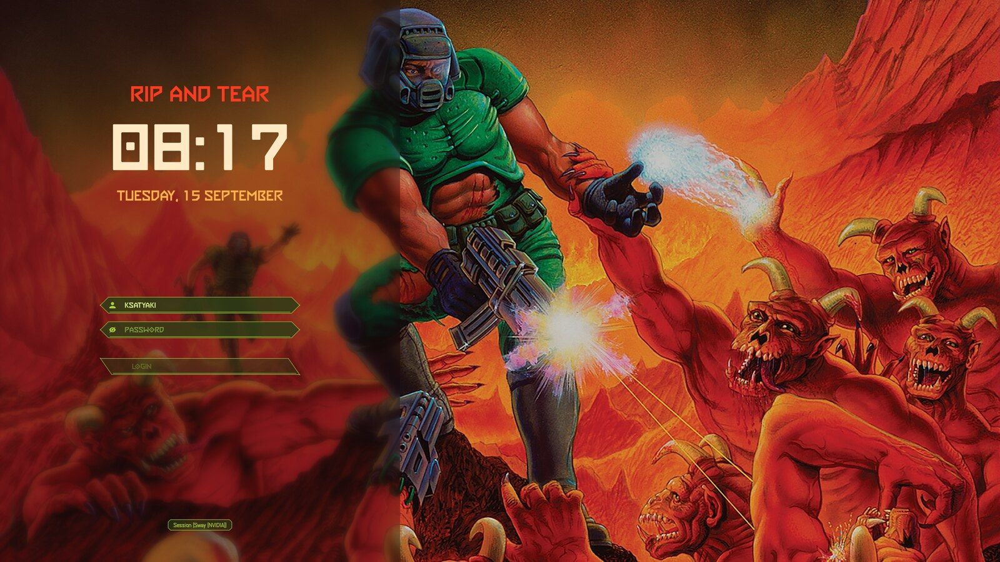
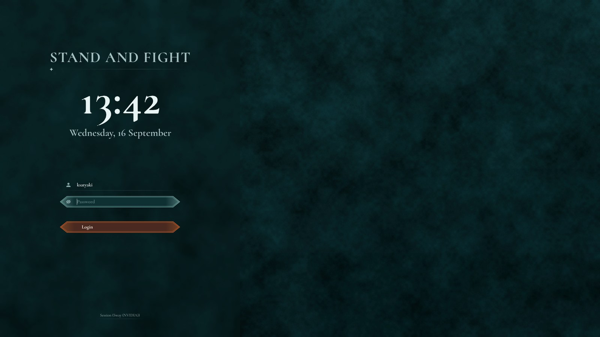
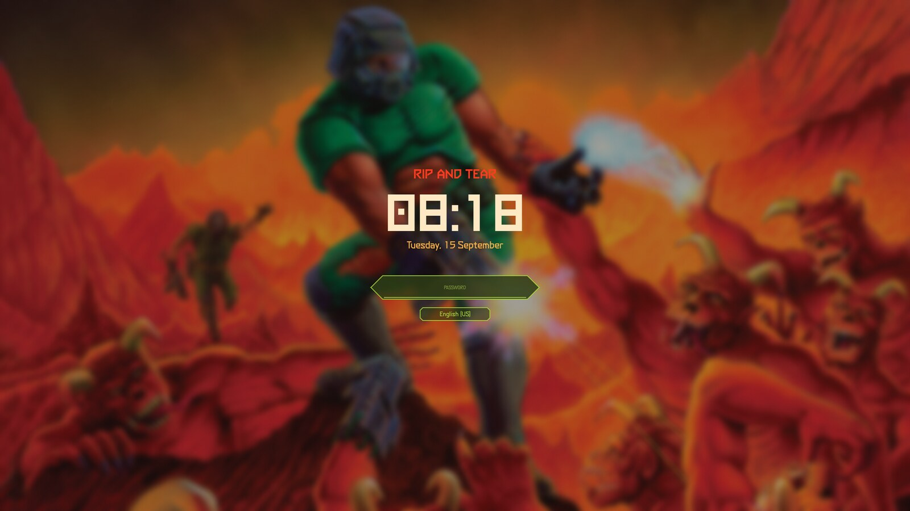

# wayland-desktop

A DOOM-flavoured Sway and Hyprland desktop: i3-style keybindings, a Waybar bar in Catppuccin Mocha, DOOM Eternal UI fonts, and matching login and lock screens. Everything needed to rebuild it is in this repo: configs mirroring `~/.config`, the SDDM theme, fonts, wallpaper and one install script. Built on Fedora 44 with an NVIDIA GPU; the installer also knows the Ubuntu/Debian package names.

<p align="center">
  
  <br><sub>Login screen (SDDM, sddm-astronaut-theme with the DOOM preset)</sub>
  <br><br>
  
  <br><sub>The alternative Dark Ages login screen (<code>--login-theme dark-ages</code>)</sub>
</p>
<p align="center">
  
  <br><sub>Lock screen (hyprlock)</sub>
</p>

## Quick start

```sh
git clone https://github.com/ksatyaki/wayland-desktop.git && cd wayland-desktop
./install.sh --help                                   # list the components
./install.sh --enable-hyprland --enable-bar --enable-theming --enable-login --packages
```

Every `--enable-*` flag installs one component (they combine freely, `--all` takes everything). `--packages` also installs the distro packages the selected components need with `dnf` (Fedora) or `apt` (Ubuntu/Debian). Existing config is kept as `*.bak-<timestamp>`. Only the login screen, the Sway session file and `--packages` use sudo.

### Dependencies

What each component pulls in with `--packages`. The Ubuntu column is from package names, not from a test install.

| Component | Fedora (dnf) | Ubuntu / Debian (apt) |
|---|---|---|
| `--enable-bar` | `waybar fuzzel mako brightnessctl playerctl grim slurp wl-clipboard wdisplays waypaper awww pavucontrol nm-connection-editor blueman gnome-keyring xdg-desktop-portal-gtk` | `waybar fuzzel mako-notifier brightnessctl playerctl grim slurp wl-clipboard wdisplays pavucontrol network-manager-gnome blueman gnome-keyring xdg-desktop-portal-gtk pipx`, then `pipx install waypaper` and [awww](https://github.com/LGFae/awww) from a release or cargo |
| `--enable-hyprland` | COPR `lionheartp/Hyprland`: `hyprland hyprlock hypridle hyprpolkitagent hyprshot hyprshutdown hyprland-guiutils xdg-desktop-portal-hyprland` | Not packaged at the needed version (>= 0.56, Lua config): [build from source](https://wiki.hyprland.org/Getting-Started/Installation/) |
| `--enable-sway` | `sway swaylock swayidle swaybg kanshi xdg-desktop-portal-wlr` | same names; plus a polkit agent such as `polkit-kde-agent-1` |
| `--enable-theming` | `pcmanfm-qt qt6ct qt5ct kvantum breeze-icon-theme` | `pcmanfm-qt qt6ct qt5ct qt6-style-kvantum breeze-icon-theme` |
| `--enable-login` | `sddm qt6-qtsvg qt6-qtvirtualkeyboard qt6-qtmultimedia` | `sddm libqt6svg6 qml6-module-qtquick-controls qml6-module-qtquick-layouts qml6-module-qtquick-shapes qml6-module-qtquick-effects qml6-module-qtmultimedia qml6-module-qtquick-virtualkeyboard libxcb-cursor0` (needs SDDM >= 0.21 with Qt 6) |
| `--enable-fonts` | nothing, the fonts are in the repo | nothing |

Fonts that are not in the repo and that the bar, launcher and app theming refer to: [JetBrainsMono Nerd Font](https://www.nerdfonts.com/font-downloads) into `~/.fonts/JetBrainsMono/`, [Iosevka](https://github.com/be5invis/Iosevka/releases) and [IBM Plex Sans](https://github.com/IBM/plex/releases) into `~/.fonts/`, then `fc-cache -f`. Fedora has IBM Plex as `ibm-plex-fonts-all`, Ubuntu as `fonts-ibm-plex`.

Binary files (fonts, wallpaper, theme assets) are stored with Git LFS; install `git-lfs` before cloning or run `git lfs pull` afterwards.

## Features, one section each

### Hyprland

Hyprland config in the Lua format of Hyprland >= 0.56: i3-style keybindings, monitor layouts matched by make/model/serial with the laptop panel switched off when docked, NVIDIA and Electron environment, window rules, Super+W tabbed groups, and the DOOM lock screen ([hyprlock](docs/login-and-lock-screen.md)) with hypridle locking after 10 minutes. Includes the fonts and wallpaper the lock screen uses. Combine with `--enable-bar` for the bar, launcher and notifications the config starts.

```sh
./install.sh --enable-hyprland --packages
```

Installs `~/.config/hypr/`. Edit the `hl.monitor` lines near the top of `hyprland.lua` for your monitors. Log out and pick "Hyprland".

### Sway

Sway config with the same keybindings, kanshi monitor profiles (laptop / home / office), a DOOM-coloured swaylock, and a "Sway (NVIDIA)" session file that adds `--unsupported-gpu` for the proprietary NVIDIA driver (the session file and `usermod -aG video` use sudo). Combine with `--enable-bar`.

```sh
./install.sh --enable-sway --packages
```

Installs `~/.config/sway/`, `~/.config/kanshi/`, `~/.config/swaylock/` and `/usr/local/share/wayland-sessions/sway-nvidia.desktop`. Edit the `output` lines in the Sway config and the profiles in the kanshi config for your monitors. Without an NVIDIA GPU pick the plain "Sway" session.

### Bar, launcher, notifications, wallpaper

Waybar (bottom bar with workspaces per monitor, app launchers, hover volume slider, network, bluetooth, a CPU/GPU metrics gauge, brightness and battery), the fuzzel launcher on Super+D in the DOOM login palette, mako notifications, and waypaper with the awww daemon for the wallpaper. Shared by both compositors; the config files exist for Sway (`config.jsonc`) and Hyprland (`config-hyprland.jsonc`). Includes the DOOM fonts and wallpaper.

```sh
./install.sh --enable-bar --packages
```

Installs `~/.config/waybar/`, `~/.config/mako/`, `~/.config/fuzzel/`, `~/.config/waypaper/`, `~/.fonts/doom/` and `~/Pictures/Wallpapers/`. The launcher buttons on the bar run `tabby`, `pcmanfm-qt`, `firefox`, `code-insiders`, `claude-desktop` and `steam`; edit the `custom/app-*` modules if you use other programs.

### App theming (Qt and GTK)

A consistent Catppuccin Mocha look for Qt and GTK apps without a Plasma or GNOME session: qt6ct and qt5ct with the Fusion style and a Catppuccin palette, GTK settings (Adwaita, breeze icons, IBM Plex Sans), `QT_QPA_PLATFORMTHEME=qt6ct` exported from `~/.zprofile`, and default apps (folders open in pcmanfm-qt).

```sh
./install.sh --enable-theming --packages
```

Installs `~/.config/qt6ct/`, `~/.config/qt5ct/`, `~/.config/gtk-3.0/`, `~/.config/gtk-4.0/`, `~/.config/mimeapps.list` and `~/.zprofile`. Details and troubleshooting in [Fonts and theming](docs/fonts-and-theming.md).

### DOOM login screen (SDDM)

Two looks, both built on [sddm-astronaut-theme](https://github.com/Keyitdev/sddm-astronaut-theme), username prefilled with the last login, installed system-wide with sudo:

- `eternal` (default): the `doom` preset in `sddm/sddm-astronaut-theme/`. DOOM box art, DOOM Eternal fonts, chamfered Eternal-style input fields and buttons.
- `dark-ages`: `sddm/sddm-dark-ages-theme/`, a DOOM: The Dark Ages restyle. Dark teal stone, the Cormorant serif, menu rows that are a hairline at rest and a spear-tipped teal bar when focused, an orange bar for the login button, "STAND AND FIGHT" over the clock.

```sh
./install.sh --enable-login --packages                          # Eternal
./install.sh --enable-login --login-theme dark-ages --packages   # Dark Ages
```

Installs `/usr/share/sddm/themes/<theme>/`, the theme fonts under `/usr/share/fonts/`, `/etc/sddm.conf.d/10-theme.conf` and `20-users.conf`, plus an editable master copy of both in `~/.config/sddm-doom-theme/`. Switch later with `sudo sh ~/.config/sddm-doom-theme/install-sddm-theme.sh dark-ages` (or `eternal`). Preview without logging out:

```sh
sddm-greeter-qt6 --test-mode --theme /usr/share/sddm/themes/sddm-dark-ages-theme
```

How the preset and the QML shapes work, and how to change the look: [Login and lock screen](docs/login-and-lock-screen.md).

### DOOM fonts

The fan-made DOOM Eternal UI fonts (`Eternal UI`, `Eternal UI 2`) used by the bar, launcher, notifications, title bars and lock screens. Every other component installs them too; this flag is for the fonts alone.

```sh
./install.sh --enable-fonts
```

Installs `~/.fonts/doom/` and runs `fc-cache`.

## Install everything

```sh
./install.sh --all --packages
```

Then fetch the fonts listed under Dependencies, edit the monitor lines for your hardware, log out and pick "Hyprland" or "Sway (NVIDIA)" in the DOOM login screen.

## What goes where

| Repo path | Installed to | Component |
|---|---|---|
| `config/hypr/` | `~/.config/hypr/` | hyprland |
| `config/sway/`, `config/kanshi/`, `config/swaylock/` | `~/.config/…` | sway |
| `system/wayland-sessions/sway-nvidia.desktop` | `/usr/local/share/wayland-sessions/` | sway |
| `config/waybar/`, `config/mako/`, `config/fuzzel/`, `config/waypaper/` | `~/.config/…` | bar |
| `wallpapers/` | `~/Pictures/Wallpapers/` | bar, hyprland, sway |
| `fonts/doom/` | `~/.fonts/doom/` | fonts (and all of the above) |
| `config/qt6ct/`, `config/qt5ct/`, `config/gtk-3.0/`, `config/gtk-4.0/`, `config/mimeapps.list` | `~/.config/…` | theming |
| `home/.zprofile` | `~/.zprofile` | theming |
| `sddm/` | `~/.config/sddm-doom-theme/`, `/usr/share/sddm/themes/`, `/etc/sddm.conf.d/` | login |
| `tools/eternal-panel.py` | not installed: regenerates the chamfered PNG panels used by hyprlock | |
| `tools/dark-ages-background.py` | not installed: regenerates the Dark Ages login background | |
| `tools/purge-kde-config.sh` | not installed: removes leftover Plasma/KDE config that overrides the Qt/GTK theming (`--dry-run` to preview; archives to `~/.local/state/`) | |
| `refcard.html` | not installed: one-page keybinding and command cheatsheet, open in a browser | |

## More documentation

- [Setup notes](docs/setup-notes.md): what each config file does, monitor layouts, the Hyprland Lua gotchas, wallpapers, Steam/Wine window rules, handy commands.
- [Fonts and theming](docs/fonts-and-theming.md): where every font is set, the Qt/GTK theming setup and its pitfalls.
- [Login and lock screen](docs/login-and-lock-screen.md): the SDDM preset, the Eternal-style QML shapes, the hyprlock panels, how to change the look.
- [refcard.html](refcard.html): keybindings and commands on one page.

## Credits

Login themes: [sddm-astronaut-theme](https://github.com/Keyitdev/sddm-astronaut-theme) by Keyitdev (GPL-3.0, see `sddm/sddm-astronaut-theme/LICENSE`); the Dark Ages theme is a restyle of it under the same licence. The Eternal UI fonts are fan-made recreations of the DOOM Eternal menu font. The Dark Ages theme uses [Cormorant](https://github.com/CatharsisFonts/Cormorant) by Christian Thalmann (SIL Open Font License). The wallpaper is the DOOM box art by Don Ivan Punchatz, © id Software, used here as fan art. Colours are [Catppuccin Mocha](https://github.com/catppuccin/catppuccin).
